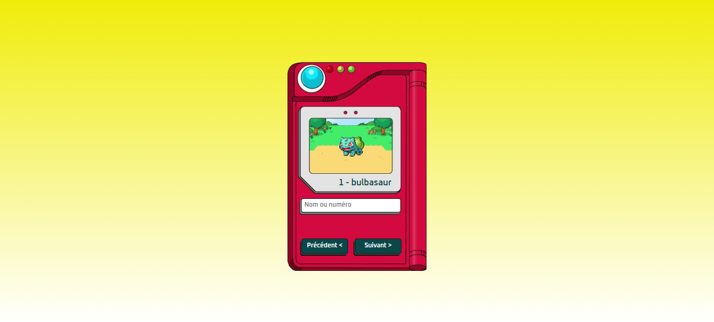

# Pokédex
Pokédex en HTML, CSS et Javascript. J'ai utilisé l'api <a href="https://www.pokeapi.co/">PokéAPI</a> pour récupérer les données sur les pokémons.

  

  <a href="#-technologies">Technologies</a> |
  <a href="#-projet">Projet</a>

  

  

## 🚀 Technologies

- HTML
- CSS
- JavaScript

## 🚧 Projet

Vous pouvez le visualiser ici: https://marra-pokedex.netlify.app
